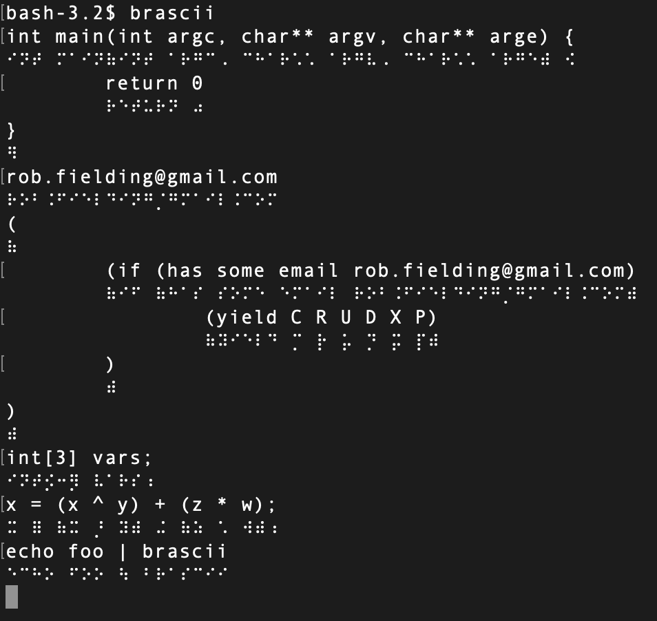

Teeny
=======

What started out as a braille editor has turned into a computer-braille tool similar to liblouis.



# Brascii

# Editor

A tiny braille editor designed for braille-first.  The use of orca+brltty means that you don't have full animation control over dots.  I want:

- modal cursors, so you can be in a vim-like session and distinguish between modes
- flashing marked carriage return marker
- do not clobber current output with current input, as ed does

# Setup

Get dependencies:

```
go mod vendor
go mod tidy
```

Run Orca, and brltty.  I turn off speech for Orca.  In different windows:

```
brltty
```

```
orca --disable=speech --replace
```

Especially run this in its own window, as you may need to run `reset` to clean up ANSI escape sequences:

```
go run cmd/teeny/main.go
```

> `ESC q` to get out
		
And if you have a bluetooth or USB capable terminal, you will have to do an actual bluetooth bind for your device before starting these.

This is a simple and modal editor:

- ESC to toggle between command and overwrite mode
- q to quit in command mode
- arrow keys to move in the buffer
 
