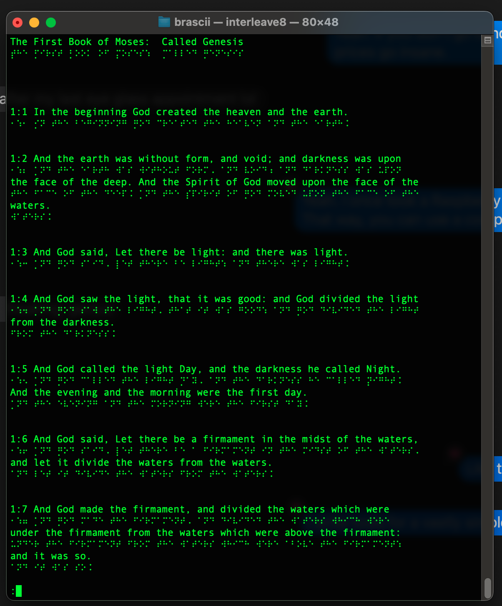

## Braille Binary

On computers, 8-dot Braille is the standard on some Displays such as the Orbit line of products. LibLouis is effectively the standard for Braille, as the description of the standard being ambiguous. The 8-dot Braille is typically terribly documented. UEB should have been defined as a Javascript function that does the translation. I am not sure if perfect forward and backwards is even possible with UEB. But with this implementation, the ASCII bytes are a perfect permutation of numbers 0-255, such that an MD5 checksum of the original file is always the same as a forward-then-backwards 8-dot computer Braille translation. This is really important. The 8-dot computer Braille translations are very trivial. The forward and backwards translations of UEB are quite difficult; certainly too hard for most sighted web developers to learn.

Here are two examples:

This is the standard UEB, which claims to be good enough to use in computing. I claim that this is a vary hard standard to learn, yet in the end, it is not a byte-exact standard. You must have a byte-exact standard if you want it to be computer-compatible in a deep way.

If you have LibLouis installed, then you can practice UEB2 by putting ASCII texts through LibLouis if you have installed it on your computer, and have `lou_translate` in your path. This is standard English Braille.


Because 8-dot computer braille is just a permutation, it is literally exactly forward and reverse identical. It is even exact to the point that even null chars, literal tabs (ie: not expanded to spaces), literal braille space (ie: so it can be rendered with an outline and exact cell size) can be preserved with the "-binary" flag. And by default, the MD5 sum of plaintext and forward-backward processed text remains the same. An interesting effect of this is that you can just learn a few new characters and read binary files better than a sighted person can.

This is the simplified 8-dot Computer Braille. In spite of the fact that dot7 use is rather rare, it is necessary; because in practice, you need more than 64 characters for any faithful representation of printable 7-bit ASCII. Sighted people can learn this Braille variant quickly, and it is byte-exact.



An interesting side-effect of this is that with BRL cells and ASCII chars never expanding to a different number of characters, you can put the physical dot print under the ink print. This lets everything that is ASCII have brl and sighted in all prints by default. At this point, the issue of how to deal with Unicode outside the 0-255 range should be handled. Technically, you can learn to just read binary Unicode for your language. But leaving bytes alone means that many command-line tools will just work without any assistance. You can edit files with vi. If you only use chars that are in the six-dot range, then you can write UEB2 in vi, even though vi knows nothing about Braille. It lets you work with a screen reader disabled as well; which is necessary to avoid certain annoyances like the scroll bar being manipulated by the screen reader.

The way that the 8-dot standard is derived from the 6-dot standard matches up very well with how actual computer braille terminals work. The braillePerm array was not made up arbitrarily. The code retains all of the steps to justify the resulting permutation.

This is how a forward translation works:

```
// ASCII to Braille for a byte to a Unicode cell
if 0 <= c && c <= 255 {
  return braillePerm[c] + 0x2800
}
```
Where whitespace characters such as space, tab, carriageReturn, lineFeed may be left as they are. 

This is how a backwards translation (cells to chars) works:

```
if 0x2800 <= c && c <= 0x28FF {
  return asciiPerm[c - 0x2800]
}
```

If a tab char is encountered, and back translation wants tab expanded to spaces, then the current setting to convert tab to space ensures that the translation is exact.

## Braile Table

> The 6-dot standard is 0x20 to 0x5F with dot7 masked off.
> Bottom half of standard is used for control codes 0x00 to 0x19.

|   |     _0|     _1|     _2|     _3|     _4|     _5|     _6|     _7|     _8|     _9|     _A|     _B|     _C|     _D|     _E|     _F|
|---|-------|-------|-------|-------|-------|-------|-------|-------|-------|-------|-------|-------|-------|-------|-------|-------|
| 0_| ⡀ <br> NUL | ⡮ <br> SOH | ⡐ <br> STX | ⡼ <br> ETX | ⡫ <br> EOT | ⡩ <br> ENQ | ⡯ <br> ACK | ⡄ <br> BEL | ⡷ <br>  BS | ⡾ <br> TAB | ⡡ <br>  LF | ⡬ <br>  VT | ⡠ <br>  FF | ⡤ <br>  CR | ⡨ <br>  SO | ⡌ <br>  SI |
| 1_| ⡴ <br> DLE | ⡂ <br> DC1 | ⡆ <br> DC2 | ⡒ <br> DC3 | ⡲ <br> DC4 | ⡢ <br> NAK | ⡖ <br> SYN | ⡶ <br> ETB | ⡦ <br> CAN | ⡔ <br>  EM | ⡱ <br> SUB | ⡰ <br> ESC | ⡣ <br>  FS | ⡿ <br>  GS | ⡜ <br>  RS | ⡹ <br>  US |
| 2_| ⠀ <br> SPC | ⠮ <br>   ! | ⠐ <br>   " | ⠼ <br>   # | ⠫ <br>   $ | ⠩ <br>   % | ⠯ <br>   & | ⠄ <br>   ' | ⠷ <br>   ( | ⠾ <br>   ) | ⠡ <br>   * | ⠬ <br>   + | ⠠ <br>   , | ⠤ <br>   - | ⠨ <br>   . | ⠌ <br>   / |
| 3_| ⠴ <br>   0 | ⠂ <br>   1 | ⠆ <br>   2 | ⠒ <br>   3 | ⠲ <br>   4 | ⠢ <br>   5 | ⠖ <br>   6 | ⠶ <br>   7 | ⠦ <br>   8 | ⠔ <br>   9 | ⠱ <br>   : | ⠰ <br>   ; | ⠣ <br>   < | ⠿ <br>   = | ⠜ <br>   > | ⠹ <br>   ? |
| 4_| ⡈ <br>   @ | ⡁ <br>   A | ⡃ <br>   B | ⡉ <br>   C | ⡙ <br>   D | ⡑ <br>   E | ⡋ <br>   F | ⡛ <br>   G | ⡓ <br>   H | ⡊ <br>   I | ⡚ <br>   J | ⡅ <br>   K | ⡇ <br>   L | ⡍ <br>   M | ⡝ <br>   N | ⡕ <br>   O |
| 5_| ⡏ <br>   P | ⡟ <br>   Q | ⡗ <br>   R | ⡎ <br>   S | ⡞ <br>   T | ⡥ <br>   U | ⡧ <br>   V | ⡺ <br>   W | ⡭ <br>   X | ⡽ <br>   Y | ⡵ <br>   Z | ⡪ <br>   [ | ⡳ <br>   \ | ⡻ <br>   ] | ⡘ <br>   ^ | ⠸ <br>   _ |
| 6_| ⠈ <br>   ` | ⠁ <br>   a | ⠃ <br>   b | ⠉ <br>   c | ⠙ <br>   d | ⠑ <br>   e | ⠋ <br>   f | ⠛ <br>   g | ⠓ <br>   h | ⠊ <br>   i | ⠚ <br>   j | ⠅ <br>   k | ⠇ <br>   l | ⠍ <br>   m | ⠝ <br>   n | ⠕ <br>   o |
| 7_| ⠏ <br>   p | ⠟ <br>   q | ⠗ <br>   r | ⠎ <br>   s | ⠞ <br>   t | ⠥ <br>   u | ⠧ <br>   v | ⠺ <br>   w | ⠭ <br>   x | ⠽ <br>   y | ⠵ <br>   z | ⠪ <br>   { | ⠳ <br>  \| | ⠻ <br>   } | ⠘ <br>   ~ | ⡸ <br> DEL |
| 8_| ⣀ <br> UNK | ⣮ <br> UNK | ⣐ <br> UNK | ⣼ <br> UNK | ⣫ <br> UNK | ⣩ <br> UNK | ⣯ <br> UNK | ⣄ <br> UNK | ⣷ <br> UNK | ⣾ <br> UNK | ⣡ <br> UNK | ⣬ <br> UNK | ⣠ <br> UNK | ⣤ <br> UNK | ⣨ <br> UNK | ⣌ <br> UNK |
| 9_| ⣴ <br> UNK | ⣂ <br> UNK | ⣆ <br> UNK | ⣒ <br> UNK | ⣲ <br> UNK | ⣢ <br> UNK | ⣖ <br> UNK | ⣶ <br> UNK | ⣦ <br> UNK | ⣔ <br> UNK | ⣱ <br> UNK | ⣰ <br> UNK | ⣣ <br> UNK | ⣿ <br> UNK | ⣜ <br> UNK | ⣹ <br> UNK |
| A_| ⢀ <br> UNK | ⢮ <br>   ¡ | ⢐ <br>   ¢ | ⢼ <br>   £ | ⢫ <br>   ¤ | ⢩ <br>   ¥ | ⢯ <br>   ¦ | ⢄ <br>   § | ⢷ <br>   ¨ | ⢾ <br>   © | ⢡ <br>   ª | ⢬ <br>   « | ⢠ <br>   ¬ | ⢤ <br>   ­ | ⢨ <br>   ® | ⢌ <br>   ¯ |
| B_| ⢴ <br>   ° | ⢂ <br>   ± | ⢆ <br>   ² | ⢒ <br>   ³ | ⢲ <br>   ´ | ⢢ <br>   µ | ⢖ <br>   ¶ | ⢶ <br>   · | ⢦ <br>   ¸ | ⢔ <br>   ¹ | ⢱ <br>   º | ⢰ <br>   » | ⢣ <br>   ¼ | ⢿ <br>   ½ | ⢜ <br>   ¾ | ⢹ <br>   ¿ |
| C_| ⣈ <br>   À | ⣁ <br>   Á | ⣃ <br>   Â | ⣉ <br>   Ã | ⣙ <br>   Ä | ⣑ <br>   Å | ⣋ <br>   Æ | ⣛ <br>   Ç | ⣓ <br>   È | ⣊ <br>   É | ⣚ <br>   Ê | ⣅ <br>   Ë | ⣇ <br>   Ì | ⣍ <br>   Í | ⣝ <br>   Î | ⣕ <br>   Ï |
| D_| ⣏ <br>   Ð | ⣟ <br>   Ñ | ⣗ <br>   Ò | ⣎ <br>   Ó | ⣞ <br>   Ô | ⣥ <br>   Õ | ⣧ <br>   Ö | ⣺ <br>   × | ⣭ <br>   Ø | ⣽ <br>   Ù | ⣵ <br>   Ú | ⣪ <br>   Û | ⣳ <br>   Ü | ⣻ <br>   Ý | ⣘ <br>   Þ | ⢸ <br>   ß |
| E_| ⢈ <br>   à | ⢁ <br>   á | ⢃ <br>   â | ⢉ <br>   ã | ⢙ <br>   ä | ⢑ <br>   å | ⢋ <br>   æ | ⢛ <br>   ç | ⢓ <br>   è | ⢊ <br>   é | ⢚ <br>   ê | ⢅ <br>   ë | ⢇ <br>   ì | ⢍ <br>   í | ⢝ <br>   î | ⢕ <br>   ï |
| F_| ⢏ <br>   ð | ⢟ <br>   ñ | ⢗ <br>   ò | ⢎ <br>   ó | ⢞ <br>   ô | ⢥ <br>   õ | ⢧ <br>   ö | ⢺ <br>   ÷ | ⢭ <br>   ø | ⢽ <br>   ù | ⢵ <br>   ú | ⢪ <br>   û | ⢳ <br>   ü | ⢻ <br>   ý | ⢘ <br>   þ | ⣸ <br>   ÿ |


The font you see in github is at the mercy of your browser.  The Unicode braille I see in Chrome on MacOS is awful by default, but good in Safari; because the guide dots make it completely illegible.  This is what I see when I import this trutype font. There is a single guide dot just under the standard 6-dot dots, and above the extended dots 7 and 8, which only exist on computer terminals.  You can set the spacing between chars and lines to your liking.  It's more legible if they are spaced wider.  With the guide dot, you won't get confused about where the cells are.


